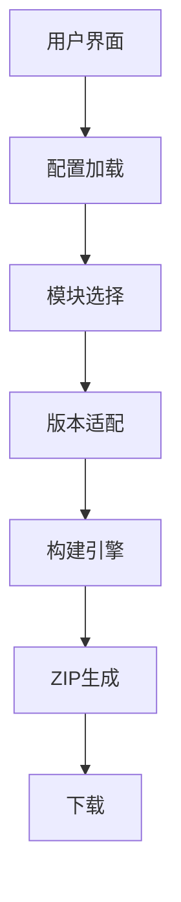

# Minecraft资源包/数据包构建工具

> 古镇天Gugle@XeKr-Dev(gugle@xekr.dev)

## 摘要

> 本项目是一个基于Web的模块化Minecraft资源包/数据包构建工具,通过创新性的纯前端架构解决了传统资源包开发中的模块复用、版本兼容和分发效率问题。
> 系统采用Vue3 + TypeScript + Vite技术栈,利用GitHub API实时获取仓库资源,通过智能版本适配引擎(
> PathFormatter和RecipeFormatter )自动转换不同
> Minecraft版本的资源格式,支持用户自定义模块组合和预设合集选择。核心构建器采用权重排序算法解决模块冲突问题,支持模块绑定、互斥检测,
> 并可将资源包打包为Fabric/Quilt/Forge/NeoForge模组格式。项目提供了标准化项目模板和配置文件格式,显著降低了资源包开发门槛,
> 促进了Minecraft社区的协作与创新。

## 关键词

> Minecraft资源包构建、Minecraft数据包构建、模块化架构、版本适配系统、前端构建引擎、GitHub集成、Zip打包、社区协作

# Minecraft Pack Builder

## Abstract

> This project is a web-based modular Minecraft Pack Builder that addresses the issues of module reuse, version
> compatibility, and distribution efficiency in traditional resource pack development through an innovative pure
> front-end architecture. Built with Vue3 + TypeScript + Vite stack, the system utilizes the GitHub API to fetch
> repository resources in real-time, automatically converting resource formats across different Minecraft versions
> via an intelligent version adaptation engine (PathFormatter and RecipeFormatter), and supporting user-customized
> module composition and preset collections. The core builder employs a weighted sorting algorithm to resolve module
> conflicts, supports module bindings and mutual exclusion detection, and can package resource packs into
> Fabric/Quilt/Forge/NeoForge mod formats. The project provides standardized project templates and configuration file
> formats, significantly lowering the barrier to entry for resource pack development and fostering community
> collaboration.

## Key words:

> Minecraft resource pack building, Minecraft data pack building, modular architecture, version adaptation system,
> front-end build engine, GitHub integration, Zip packaging, community collaboration

## 一、引言

Minecraft（我的世界）作为一款风靡全球的沙盒游戏，其可扩展性通过资源包（Resource Pack）和数据包（Data Pack）得到极大增强。
资源包用于修改游戏的纹理、声音和模型等资源，而数据包则用于修改游戏逻辑、添加进度和配方等。然而，随着资源包和数据包的功能日益复杂，
其构建和管理过程也变得繁琐。特别是当开发者希望提供多个可选模块供用户自定义时，手动合并模块并确保兼容性成为一项挑战。

Minecraft资源包/数据包构建工具是一个基于Web的前端应用，旨在解决Minecraft社区中资源包和数据包开发与分发的痛点问题。传统资源包开发面临以下挑战：

- 模块化不足：资源包通常作为整体分发，用户无法按需选择功能模块
- 版本兼容性：不同Minecraft版本需要不同的资源格式
- 分发效率低：开发者需要手动打包不同配置的资源包

本项目通过创新的模块化架构和自动化构建流程，实现了：

- 用户自定义选择：允许用户自由组合所需模块
- 智能版本适配：自动转换资源格式以适应目标版本
- 云端构建系统：基于GitHub API实现一键式打包分发
- 开源协作模式：标准化项目结构促进社区贡献

## 二、详细解读

### 1. 系统架构



### 2. 项目结构

项目采用Vue3作为前端框架,使用TypeScript进行类型安全开发,Vite作为构建工具,主要代码位于`src`目录下:

**核心目录结构:**

- `src/components`:UI组件(FileSelectorDialog、FakeProgress、MarkdownView、Notice、PageHeader)
- `src/pages`:主页面(HomePage.vue)实现用户交互逻辑
- `src/scripts`:核心业务逻辑模块
    - `builder`:构建器实现
        - `impl/index.ts`:抽象构建器(AbstractBuilder)定义核心构建流程
        - `impl/online.ts`:在线构建器(OnlineBuilder)通过GitHub API获取文件
        - `impl/file.ts`:本地构建器(FileBuilder)支持从本地ZIP构建
    - `formatter`:格式转换器
        - `impl/path.ts`:路径格式转换器(PathFormatter)处理不同版本的文件路径变化
        - `impl/recipe.ts`:配方格式转换器(RecipeFormatter)处理三种配方格式(24w10a前、24w10a-24w33a、24w33a后)
    - `github`:GitHub API封装
    - `message`:消息提示系统
    - `request`:HTTP请求封装
    - `type`:TypeScript类型定义
    - `util`:工具函数
    - `version`:版本比较工具

**配置文件:**

- `config.json`:资源包基本信息(名称、作者、版本、主模块、版本模块等)
- `module.config.json`:模块配置(模块名、权重、互斥关系、绑定关系)
- `*.set.config.json`:预设合集配置

**技术栈:**

- 框架:Vue3 + TypeScript + Vite
- UI组件库:Arco Design
- HTTP客户端:Axios
- ZIP处理:JSZip
- Markdown渲染:Marked + DOMPurify
- 样式:Sass

### 3. 核心功能实现

#### (1) 配置解析

工具首先加载并解析仓库根目录的`config.json`，获取资源包/数据包的基本配置，包括主模块路径、版本模块映射等。

#### (2) 模块选择与权重排序

用户可通过两种方式选择模块:

1. **直接选择**:从模块列表中勾选所需模块
2. **合集选择**:选择作者预设的模块组合

**智能依赖处理:**

- **模块互斥**(`breaks`):检测冲突模块,自动禁用不兼容选项
- **模块绑定**(`bindings`):选择某模块时自动选中其依赖模块
- **权重排序**:模块按`weight`值从小到大排序,高权重模块覆盖低权重模块的同名文件

**实现逻辑**(HomePage.vue):

```typescript
// 检查模块是否因冲突被禁用
function checkModuleDisabled(key: string) {
    const self = modules.value.get(key)
    // 检查选中模块的breaks列表
    for (const subKey of selectedModules.value) {
        for (let breakKey of self.breaks) {
            if (subKey == breakKey) return true // 已选中冲突模块
        }
    }
    // 检查绑定模块是否可用
    if (self.bindings) {
        for (let binding of self.bindings) {
            if (checkModuleDisabled(binding)) return true
        }
    }
    return false
}

// 自动选择绑定的模块
function selectWithBindings(key: string) {
    selectedModules.value.push(key)
    if (self.bindings) {
        for (let binding of self.bindings) {
            selectWithBindings(binding) // 递归选择绑定模块
        }
    }
}
```

#### (3) 构建流程

构建流程由`AbstractBuilder.build`方法实现,采用异步Promise链式处理:

**1. 版本信息确定**

```typescript
const minecraftVersion = mcVersions[this.version]
const packFormat = this.type === "data"
    ? minecraftVersion.datapack_version
    : minecraftVersion.resources_version
```

**2. 生成pack.mcmeta元数据**

```typescript
const metaJson: MetaJson = {
    pack: {
        description: [{text: `§6§l${this.config.description} v${this.config.version}\n`}],
        // 根据版本使用pack_format(旧)或min_format/max_format(新)
    }
}
```

**3. 加载主模块**

```typescript
this.getFileTree(`${basePath}/${this.config.main_module}`).then(res => {
    let pack: FileOrTree = res
    // 注入或更新pack.mcmeta
})
```

**4. 处理版本模块**

```typescript
// noinspection JSAnnotator

if (this.config.version_modules) {
    // 版本比较,选择最合适的版本模块
    if (Version.compareMC(this.version, versionModule.version) < 0) continue
    if (strict && Version.compareMC(...) !== 0) continue
    // 版本模块可覆盖主模块或其他模块
}
```

**5. 合并选中的模块(按权重排序)**

```typescript
moduleList = moduleList.sort((a, b) => a.weight - b.weight)
for (let module of moduleList) {
    pack = this.mergeFileOrTree(pack, module.files!!)
    // 应用该模块的版本模块(如果有)
}
```

**6. 文件树合并算法**

```typescript
class AbstractBuilder {
    publicmergeFileOrTree(file1: FileOrTree, file2: FileOrTree): FileOrTree {
        // 深度递归合并
        for (let child of file2.children) {
            if (child.content !== undefined) {
                child1.content = child.content // 文件覆盖
            }
            if (child.children !== undefined) {
                child1.children = this.mergeFileOrTree(child, child1).children // 目录递归
            }
        }
    }
}
```

**7. 内容预处理与格式转换**

```typescript
class AbstractBuilder {
    public preprocessContent(content: string, path: string) {
        const type = path.split("/")[2]
        if (type === "recipe" || type === "recipes") {
            content = RecipeFormatter.format(content, this.minecraftVersion)
        }
        return content
    }
}
```

**8. ZIP文件生成**

```typescript
const zip: JSZip = new JSZip()
this.fileTreeToZip(zip, pack) // 递归添加文件
if (this.mod) this.buildModZip(zip) // 模组模式额外处理
zip.generateAsync({type: "blob"}).then(blob => resolve(blob))
```

**9. 模组格式支持**

```typescript
class AbstractBuilder {
    public buildModZip(zip: JSZip) {
        // Forge/NeoForge: META-INF/mods.toml, META-INF/neoforge.mods.toml
        // Fabric: fabric.mod.json
        // Quilt: quilt.mod.json
    }
}
```

**构建器模式:**

- **OnlineBuilder**:通过`GithubAPI.getRepoContents()`递归获取文件树
- **FileBuilder**:从本地上传的ZIP文件构建(支持`file_mode`)

#### (4) 版本适配系统

**版本数据库**(`minecraft_version.json`)

```json
{
  "1.21.7": {
    "type": "release",
    "datapack_version": 69,
    "resources_version": 46
  }
}
```

**PathFormatter - 路径格式转换器**

不同Minecraft版本对数据包路径命名有变化,如1.21(pack_format 45)后:

```typescript
PathFormatter.dataPathMap.set(45, [
    {from: "structures", to: "structure"},
    {from: "advancements", to: "advancement"},
    {from: "recipes", to: "recipe"},
    {from: "loot_tables", to: "loot_table"},
    {from: "predicates", to: "predicate"},
    {from: "item_modifiers", to: "item_modifier"},
    {from: "functions", to: "function"}
])
```

转换逻辑:

```typescript
class PathFormatter {
    public static format(path: string, version): string {
        const pathSplit = path.split("/")
        if (version.datapack_version >= 45) {
            // structures -> structure
        } else {
            // structure -> structures (反向转换)
        }
    }
}
```

**RecipeFormatter - 配方格式转换器**

Minecraft配方格式经历三次重大变更:

1. **24w10a前** (datapack_version < 34):

    ```json
    {
      "result": {
        "item": "minecraft:diamond",
        "count": 1
      }
    }
    ```

2. **24w10a-24w33a** (34 ≤ datapack_version < 49):

    ```json
    {
      "result": {
        "id": "minecraft:diamond",
        "count": 1
      }
    }
    ```

3. **24w33a后** (datapack_version ≥ 49):

    ```json5
    {
      "key": {
        "#": "#minecraft:diamond" // tag简化为#标记
      },
      "ingredient": "minecraft:stick", // 直接使用字符串
      "result": {
        "id": "minecraft:diamond",
        "count": 1
      }
    }
    ```

转换器自动检测并转换:

```typescript
class RecipeFormatter {
    public static format(content: string, version): string {
        let recipe = JSON.parse(b64tou(content))
        if (version.datapack_version >= 49) {
            recipe = RecipeFormatter.toMore24w33a(recipe)
        } else if (version.datapack_version >= 34) {
            recipe = RecipeFormatter.toBetween24w10aTo24w33a(recipe)
        } else {
            recipe = RecipeFormatter.toLess24w10a(recipe)
        }
        return utob64(JSON.stringify(recipe, null, 4))
    }
}
```

#### (5) GitHub API集成

**API封装**(`src/scripts/github/index.ts`):

```typescript
// noinspection JSAnnotator
export class GithubAPI {
    static getRepoContents(repo: string, path: string): Promise<RepoContents>

    static getRepoReadme(repo: string): Promise<RepoFileContent>

    static getRepoZip(repo: string): Promise<void>
}
```

**认证机制:**

- 未认证用户:60请求/小时
- Personal Access Token:5000请求/小时
- 所需权限:`public_repo`、`read:project`
- 存储方式:localStorage(纯前端,无后端)

**数据获取流程:**

1. 加载`config.json`获取基本配置
2. 递归获取模块目录下的`module.config.json`
3. 加载`sets_path`下的合集配置
4. 加载`README.md`用于展示
5. 构建时递归获取文件树(OnlineBuilder)

**在线/离线构建模式:**

- **online模式**:实时从GitHub获取文件(默认)
- **file模式**:用户上传仓库ZIP包本地构建(适用于私有仓库或网络受限)

### 4. 关键技术点

**1. 模块化架构设计**

- 主模块 + 可选模块 + 版本模块的三层结构
- 每个模块独立开发和维护,支持热插拔
- 模块配置标准化(`module.config.json`)

**2. 智能版本适配系统**

- **双层版本控制**:数据包版本(datapack_version)和资源包版本(resources_version)独立管理
- **版本模块系统**:为不同Minecraft版本提供差异化内容
    - `strict`模式:严格版本匹配
    - 非strict:向后兼容(选择≤目标版本的最新版本模块)
    - `version_reverse`:支持反向版本排序
- **格式自动转换**:PathFormatter和RecipeFormatter无缝转换资源格式

**3. 冲突检测与依赖管理**

- **互斥关系**(`breaks`):声明不兼容模块,UI自动禁用冲突选项
- **绑定关系**(`bindings`):自动选择依赖模块
- **权重系统**(`weight`):细粒度控制文件覆盖优先级

**4. 双构建器模式**

- **OnlineBuilder**:GitHub API实时构建,适用于公开仓库
- **FileBuilder**:本地ZIP构建,支持私有仓库和离线场景
- 统一接口设计(AbstractBuilder抽象类)

**5. 跨平台模组支持**

- 一键打包为Fabric/Quilt/Forge/NeoForge模组
- 自动生成模组元数据文件:
    - `fabric.mod.json`(Fabric)
    - `quilt.mod.json`(Quilt)
    - `META-INF/mods.toml`(Forge)
    - `META-INF/neoforge.mods.toml`(NeoForge)

**6. 纯前端架构**

- 无需服务器,静态部署即可运行
- 数据安全:PAT存储在用户本地浏览器
- JSZip实现客户端ZIP打包

**7. 用户体验优化**

- URL路由记忆仓库地址(`/#/owner/repo`)
- 伪进度条提供构建反馈
- Markdown渲染README展示项目说明
- 版本选择支持快照版本过滤

### 5. 完整工作流程

**阶段一:仓库加载**

1. 用户输入GitHub仓库URL(如`https://github.com/XeKr-Dev/minecraft-pack-template`)
2. 点击"加载"按钮,触发`loadRepo()`
3. 解析仓库地址,更新URL路由(`/#/XeKr-Dev/minecraft-pack-template`)
4. 并行请求:
    - `config.json`:获取基本配置
    - `README.md`:获取项目说明
    - 图标文件:加载并放大处理(imageMagnify)
5. 递归加载所有模块的`module.config.json`
6. 加载`sets_path`下的所有合集配置

**阶段二:用户配置**

1. 选择模块:
    - 直接勾选模块列表
    - 或选择预设合集(自动填充模块)
2. 实时冲突检测:
    - 禁用与已选模块互斥的选项
    - 自动选中绑定的依赖模块
3. 选择目标Minecraft版本:
    - 支持快照版本显示切换
    - 显示对应的数据包/资源包格式版本号
4. 选择构建类型:
    - "全部":同时包含资源包和数据包
    - "资源包":仅包含`assets/`
    - "数据包":仅包含`data/`
5. 可选:勾选"构建模组"生成Fabric/Quilt/Forge/NeoForge兼容格式

**阶段三:构建过程**

1. 点击"构建"按钮,触发`build()`
2. 构建器初始化:
    - 确定使用OnlineBuilder或FileBuilder
    - 获取目标版本的pack_format信息
3. 文件获取:
    - 加载主模块文件树
    - 根据目标版本选择并加载版本模块
    - 按权重排序加载用户选中的模块
4. 内容处理:
    - 路径格式转换(PathFormatter)
    - 配方格式转换(RecipeFormatter)
    - 文件树递归合并(高权重覆盖低权重)
5. 元数据生成:
    - 注入或更新`pack.mcmeta`
    - 添加`pack.png`图标
    - (模组模式)生成模组配置文件
6. ZIP打包:
    - JSZip递归添加文件
    - 根据构建类型过滤目录
    - 生成Blob对象

**阶段四:交付下载**

1. 使用FileSaver.js触发浏览器下载
2. 文件命名格式:`{pack_name}-{version}-{type}-mc{minecraft_version}.{jar|zip}`
3. 示例:`BetterTools-1.0.0-all-mc1.21.7.zip`

## 三、用例

### 用例1：创建一个名为“BetterTools”的资源包

**场景**：开发者创建了一个资源包，并希望将工具材质从原版材质替换为金质材质或钻石材质。

- 假设开发者“XeKr”创建了一个名为“BetterTools”的资源包，该资源包包含以下模块：
    - `main`：主模块，包含基础纹理。
    - `gold`：将工具纹理替换为金质。
    - `diamond`：将工具纹理替换为钻石质。
- 用户希望同时使用金质和钻石质纹理，但钻石质模块应覆盖金质模块（即钻石质工具优先）。开发者配置如下：

    1. **config.json**:
       ```json
       { 
           "pack_name": "BetterTools", 
           "author": "XeKr", 
           "description":"Better tools texture", 
           "version": "1.0.0", 
           "base_path": "./src", 
           "main_module": "main", 
           "icon": "./icon.png"
       }
       ```

    2. **module.config.json**（位于gold模块内）:
       ```json 
       { 
           "module_name": "gold", 
           "support_version": "*", 
           "weight": 0 
       } 
       ```

    3. **module.config.json**（位于diamond模块内）:
       ```json 
       { 
           "module_name": "diamond", 
           "support_version": "*", 
           "weight": 1 
       }
       ```

用户操作步骤：

1. 在工具界面输入仓库地址：`https://github.com/XeKr-Dev/BetterTools`
2. 加载配置后，选择`gold`和`diamond`模块（注意：由于钻石模块权重更高，它将覆盖金质模块的纹理）。
3. 选择目标Minecraft版本（如1.20.1）。
4. 点击“构建”按钮，工具将生成一个资源包ZIP文件。 生成的文件中，钻石质工具的纹理将覆盖金质工具的纹理，最终效果为钻石质工具。

### 用例2：用户自定义资源包

**场景**：玩家想要创建包含`高清材质`和`动态光影`但不包含`真实物理`的资源包

1. 访问构建器页面
2. 输入资源包仓库URL
3. 加载配置后，勾选`高清材质`、`动态光影`模块，不勾选`真实物理`模块
4. 选择Minecraft `1.20.1`版本
5. 点击`构建`按钮
6. 获取定制化资源包ZIP

### 用例3：开发者维护多版本支持

**场景**：开发者需要为`1.19`和`1.20`提供兼容的资源包

1. 创建version_1.19和version_1.20模块
2. 在config.json中配置版本映射
   ```json
   {
     "version_modules": {
       "1.19": {"module": "version_1.19", "strict": false},
       "1.20": {"module": "version_1.20", "strict": true}
     }
   }
   ```

3.用户选择版本时自动加载对应模块

### 用例4：社区模块共享

**场景**：社区开发者贡献新模型模块

1. 在仓库中创建new_creatures目录
2. 添加module.config.json：
   ```json
   {
     "module_name": "fantasy_creatures",
     "description": "添加奇幻模型",
     "support_version": "*",
     "weight": 5,
     "breaks": ["realistic_physics"]
   }
   ```
3. 用户即可在构建器中看到并选择该模块

## 四、创新点

**1. 三层模块化覆盖系统**

- 主模块提供基础内容
- 版本模块提供版本差异化适配
- 可选模块提供功能扩展
- 权重机制实现精细化文件覆盖控制

**2. 智能版本适配引擎**

- **自动化格式转换**:PathFormatter和RecipeFormatter自动处理跨版本兼容
- **版本智能匹配**:非严格模式下自动选择最合适的版本模块
- **双版本系统**:资源包和数据包版本独立管理
- **支持版本跨度**:从远古版本到最新快照的全覆盖

**3. 纯前端零服务架构**

- **完全静态部署**:无需后端服务器,降低运维成本
- **数据隐私保护**:GitHub PAT存储于用户本地浏览器
- **客户端构建**:JSZip实现浏览器内ZIP打包
- **实时构建**:直接从GitHub仓库拉取最新内容

**4. 依赖关系图谱系统**

- **互斥检测**(`breaks`):自动禁用冲突模块
- **依赖绑定**(`bindings`):自动选择依赖项
- **UI实时反馈**:视觉化显示模块可用状态

**5. 多平台模组一键打包**

- 支持Fabric、Quilt、Forge、NeoForge四大模组加载器
- 自动生成对应元数据文件
- 单一资源包同时兼容原版和模组环境

**6. 标准化开源协作模式**

- 提供项目模板仓库快速启动
- 配置文件格式标准化
- 降低社区贡献门槛
- 通过GitHub实现去中心化分发

**7. 双构建模式支持**

- 在线模式:适用于公开仓库,实时获取
- 离线模式:支持私有仓库和网络受限环境

**8. 渐进式用户体验**

- URL路由记忆仓库地址,支持直接分享链接
- 伪进度条提供构建反馈
- Markdown渲染README,项目说明直接展示
- 建议版本自动预选,减少用户决策负担

## 五、技术亮点与性能优化

**1. 异步并发处理**

```typescript
const promises: Promise<any>[] = []
for (let module of moduleList) {
    promises.push(this.getFileTree(module.path))
}
Promise.all(promises).then(() => { /* 合并处理 */
})
```

并发加载所有模块文件树,显著减少构建时间。

**2. 懒加载与按需获取**

- 仅在用户点击"构建"时才获取文件内容
- 根据构建类型过滤不需要的文件(data/assets)

**3. Base64编码优化**

```typescript
const cleanBase64 = b64.replace(/\s+/g, '') // 清理空白字符
const buffer = new Uint8Array(atob(cleanBase64)) // 二进制转换
```

**4. 递归树结构处理**

- 文件树采用递归结构存储
- 合并算法深度优先遍历,O(n)时间复杂度

## 六、应用场景

**1. 资源包开发者**

- 提供多个可选材质模块,让玩家自由组合
- 维护多版本兼容,自动适配目标版本
- 示例:PvP材质包(低火、短剑、清爽界面等可选模块)

**2. 数据包开发者**

- 模块化游戏机制(如RPG系统、技能树、经济系统)
- 玩家可按需选择功能模块
- 示例:小游戏合集(空岛生存、跑酷、PvP竞技场等)

**3. 整合包制作者**

- 快速定制符合整合包主题的资源包
- 批量生成不同配置的资源包分发给玩家

## 结论

本项目通过创新的纯前端架构和模块化设计,为Minecraft资源包/数据包开发提供了一套完整的工具链解决方案。核心技术贡献包括:

1. **三层模块化系统**:主模块+版本模块+可选模块的灵活组合架构
2. **智能版本适配引擎**:PathFormatter和RecipeFormatter实现跨版本无缝转换
3. **依赖关系图谱**:互斥检测和绑定系统确保模块兼容性
4. **零服务器架构**:完全前端实现,保护用户隐私并降低部署成本
5. **多平台模组支持**:一键打包为Fabric/Quilt/Forge/NeoForge格式

项目显著降低了资源包开发门槛,使开发者能够专注于内容创作而非技术细节,同时为玩家提供了高度定制化的选择自由。标准化的配置格式和项目模板促进了社区协作,
通过GitHub实现去中心化的开源分发模式。

技术栈选择(Vue3 + TypeScript + Vite)确保了代码的可维护性和类型安全,JSZip和Axios等成熟库的集成保证了功能稳定性。
异步并发处理和懒加载优化使构建过程高效流畅。

该工具已成为Minecraft社区资源开发的实用工具,未来可进一步提升开发效率,推动Minecraft内容创作生态的繁荣发展。
