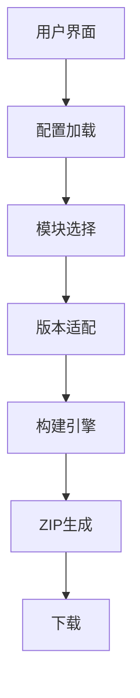

# Minecraft资源包/数据包构建工具

> 古镇天Gugle@XeKr-Dev(gugle@xekr.dev)

## 摘要

> 本项目是一个基于Web的模块化Minecraft资源包/数据包构建工具，通过创新性的前端架构解决了传统资源包开发中的模块复用、版本兼容和分发效率问题。
> 系统采用纯前端实现，利用GitHub API获取仓库资源，通过智能版本适配引擎自动转换不同Minecraft版本的资源格式，并实现用户自定义模块组合功能。
> 核心构建器采用权重排序算法解决模块冲突问题，最终生成定制化ZIP资源包。项目提供了标准化项目模板和配置文件格式，显著降低了资源包开发门槛，
> 促进了Minecraft社区的协作与创新。

## 关键词

> Minecraft资源包构建、Minecraft数据包构建、模块化架构、版本适配系统、前端构建引擎、GitHub集成、Zip打包、社区协作

# Minecraft Pack Builder

## Abstract

> This project is a web-based modular Minecraft Pack Builder that addresses the issues of module reuse, version 
> compatibility, and distribution efficiency in traditional resource pack development through an innovative front-end 
> architecture. The system is implemented purely on the front end, utilizing the GitHub API to fetch repository 
> resources, automatically converting resource formats across different Minecraft versions via an intelligent version 
> adaptation engine, and enabling user-customized module composition. The core builder employs a weighted sorting 
> algorithm to resolve module conflicts, ultimately generating customized ZIP resource packs. The project provides
> standardized project templates and configuration file formats, significantly lowering the barrier to entry for 
> resource pack development.

## Key words:

> Minecraft resource pack building, Minecraft data pack building, modular architecture, version adaptation system,
> front-end build engine, GitHub integration, Zip packaging, community collaboration

## 一、引言

Minecraft（我的世界）作为一款风靡全球的沙盒游戏，其可扩展性通过资源包（Resource Pack）和数据包（Data Pack）得到极大增强。资源包用于修改游戏
的纹理、声音和模型等资源，而数据包则用于修改游戏逻辑、添加进度和配方等。然而，随着资源包和数据包的功能日益复杂，其构建和管理过程也变得繁琐。
特别是当开发者希望提供多个可选模块供用户自定义时，手动合并模块并确保兼容性成为一项挑战。

Minecraft资源包/数据包构建工具是一个基于Web的前端应用，旨在解决Minecraft社区中资源包和数据包开发与分发的痛点问题。传统资源包开发面临以下挑战：

- 模块化不足：资源包通常作为整体分发，用户无法按需选择功能模块
- 版本兼容性：不同Minecraft版本需要不同的资源格式
- 分发效率低：开发者需要手动打包不同配置的资源包

本项目通过创新的模块化架构和自动化构建流程，实现了：

- 用户自定义选择：允许用户自由组合所需模块
- 智能版本适配：自动转换资源格式以适应目标版本
- 云端构建系统：基于GitHub API实现一键式打包分发
- 开源协作模式：标准化项目结构促进社区贡献

## 二、详细解读

### 1. 系统架构



### 2. 项目结构

项目采用Vue.js作为前端框架，主要代码位于`src`目录下。核心功能由`src/scripts`中的多个模块实现：

- `builder`：负责构建资源包/数据包的ZIP文件，包括获取仓库内容、处理路径、合并模块和生成ZIP。
- `formatter`：提供对特定文件（如配方和路径）的格式化功能，以适应不同Minecraft版本。
- `github`：封装与GitHub API的交互，用于获取仓库内容。 - 其他辅助模块（`message`、`request`、`type`、`util`、`version`）提供支持功能。
- 项目配置文件包括：
    - `config.json`：定义资源包/数据包的基本信息，如名称、作者、版本、主模块、版本模块等。
    - `module.config.json`：定义每个模块的信息，如模块名称、描述、支持的版本、权重和冲突模块。
    - `*.set.config.json`：定义模块合集，包含多个模块的组合。

### 3. 核心功能实现

#### (1) 配置解析

工具首先加载并解析仓库根目录的`config.json`，获取资源包/数据包的基本配置，包括主模块路径、版本模块映射等。

#### (2) 模块选择与权重排序

用户选择的模块（包括直接选择的模块和通过合集选择的模块）会被记录，每个模块有一个权重值。在构建时，模块按权重从小到大排序，确保高权重模块的内容覆盖
低权重模块（即高权重模块的修改优先级更高）。

#### (3) 构建流程

构建流程由`Builder.build`方法实现，步骤如下：

1. **确定目标Minecraft版本**：根据用户选择的版本，获取对应的数据包格式版本和资源包格式版本。
2. **获取主模块内容**：读取主模块（`config.json`中指定的`main_module`）的文件树。
3. **添加版本模块**：根据目标版本查找对应的版本模块（如果有），并将其内容合并到主模块中。
4. **添加图标**：如果配置了图标，则将其添加为资源包的`pack.png`。
5. **合并用户选择的模块**：按权重顺序依次合并每个选中的模块。合并过程中，如果文件路径相同，则高权重模块的内容会覆盖低权重模块的内容。
6. **生成ZIP文件**：将合并后的文件树转换为ZIP文件。在生成过程中，根据构建类型（资源包、数据包或全部）过滤文件。
7. **支持模组格式**：如果构建类型为模组（`mod=true`），则额外生成`fabric.mod.json`和`quilt.mod.json`等模组配置文件。

```typescript
class Builder {
    // 文件树合并算法
    static mergeFileOrTree(file1: FileOrTree, file2: FileOrTree): FileOrTree {
        // 智能合并模块内容，处理冲突
    }

    // 版本适配处理器
    static preprocessContent(content: string, path: string, version) {
        if (path.includes("recipe")) {
            return RecipeFormatter.format(content, version); // 配方格式转换
        }
        return PathFormatter.format(content, version); // 路径格式转换
    }

    // ZIP打包流程
    static build(): Promise<Blob> {
        // 1. 加载主模块
        // 2. 添加版本模块
        // 3. 合并用户选择模块
        // 4. 生成ZIP文件
    }
}
```

#### (4) 版本适配系统

- `minecraft_version.json`：存储各版本资源格式规范
- 使用`PathFormatter`调整文件路径以适应目标Minecraft版本。
- 使用`RecipeFormatter`调整配方文件内容以适应目标Minecraft版本。

#### (5) 依赖GitHub API

工具通过GitHub API获取仓库内容。由于未认证用户每小时只能发起60次请求，因此用户需要提供Personal Access Token以增加请求限额。

### 4. 关键技术点

- **模块化设计**：资源包/数据包被拆分为多个模块，每个模块可独立开发和维护。
- **版本适配**：通过版本模块和文件格式化器，确保生成的内容兼容用户选择的Minecraft版本。
- **冲突解决**：模块配置中可定义`breaks`字段，声明不兼容的模块，工具在用户选择时会检查并避免冲突。
- **权重合并**：通过权重控制模块的覆盖顺序，实现灵活的定制。

### 5. 工作流程

1. 配置加载：解析仓库中的config.json
2. 模块选择：用户选择所需模块或预设合集
3. 版本确定：选择目标Minecraft版本
4. 内容获取：通过GitHub API获取模块内容
5. 格式转换：根据目标版本调整资源格式
6. 合并打包：按模块权重合并内容生成ZIP
7. 下载交付：自动触发下载

## 三、用例

### 用例1：创建一个名为“BetterTools”的资源包

**场景**：开发者创建了一个资源包，并希望将工具材质从原版材质替换为金质材质或钻石材质。

- 假设开发者“XeKr”创建了一个名为“BetterTools”的资源包，该资源包包含以下模块：
    - `main`：主模块，包含基础纹理。
    - `gold`：将工具纹理替换为金质。
    - `diamond`：将工具纹理替换为钻石质。
- 用户希望同时使用金质和钻石质纹理，但钻石质模块应覆盖金质模块（即钻石质工具优先）。开发者配置如下：

    1. **config.json**:
       ```json
       { 
           "pack_name": "BetterTools", 
           "author": "XeKr", 
           "description":"Better tools texture", 
           "version": "1.0.0", 
           "base_path": "./src", 
           "main_module": "main", 
           "icon": "./icon.png"
       }
       ```

    2. **module.config.json**（位于gold模块内）:
       ```json 
       { 
           "module_name": "gold", 
           "support_version": "*", 
           "weight": 0 
       } 
       ```

    3. **module.config.json**（位于diamond模块内）:
       ```json 
       { 
           "module_name": "diamond", 
           "support_version": "*", 
           "weight": 1 
       }
       ```

用户操作步骤：

1. 在工具界面输入仓库地址：`https://github.com/XeKr/BetterTools`
2. 加载配置后，选择`gold`和`diamond`模块（注意：由于钻石模块权重更高，它将覆盖金质模块的纹理）。
3. 选择目标Minecraft版本（如1.20.1）。
4. 点击“构建”按钮，工具将生成一个资源包ZIP文件。 生成的文件中，钻石质工具的纹理将覆盖金质工具的纹理，最终效果为钻石质工具。

### 用例2：用户自定义资源包

**场景**：玩家想要创建包含`高清材质`和`动态光影`但不包含`真实物理`的资源包

1. 访问构建器页面
2. 输入资源包仓库URL
3. 加载配置后，勾选`高清材质`、`动态光影`模块，不勾选`真实物理`模块
4. 选择Minecraft `1.20.1`版本
5. 点击`构建`按钮
6. 获取定制化资源包ZIP

### 用例3：开发者维护多版本支持

**场景**：开发者需要为`1.19`和`1.20`提供兼容的资源包

1. 创建version_1.19和version_1.20模块
2. 在config.json中配置版本映射
   ```json
   {
     "version_modules": {
       "1.19": {"module": "version_1.19", "strict": false},
       "1.20": {"module": "version_1.20", "strict": true}
     }
   }
   ```

3.用户选择版本时自动加载对应模块

### 用例4：社区模块共享

`场景`：社区开发者贡献新模型模块

1. 在仓库中创建new_creatures目录
2. 添加module.config.json：
   ```json
   {
     "module_name": "fantasy_creatures",
     "description": "添加奇幻模型",
     "support_version": "*",
     "weight": 5,
     "breaks": ["realistic_physics"]
   }
   ```
3. 用户即可在构建器中看到并选择该模块

## 四、创新点

1. 模块化覆盖系统：通过权重机制解决资源冲突
2. 动态格式转换：适配不同Minecraft版本的资源规范
3. 无服务端架构：完全前端实现，保护用户PAT安全
4. 标准化项目结构：降低社区贡献门槛

## 结论

本项目提供了一个高效、灵活的Minecraft资源包/数据包构建工具，通过模块化设计和自动化构建流程，极大简化了多模块资源包/数据包的构建过程。开发者可以专
注于模块开发，而用户则可以通过图形界面轻松定制自己的资源包/数据包。通过创新的技术方案解决了Minecraft资源包开发中的关键问题，提供了从开发到分发的
一体化解决方案。其模块化架构、智能版本转换和GitHub集成等特点，使其成为Minecraft社区资源开发的理想工具。未来可考虑增加本地文件支持、更多版本适配
和冲突自动检测等功能。
